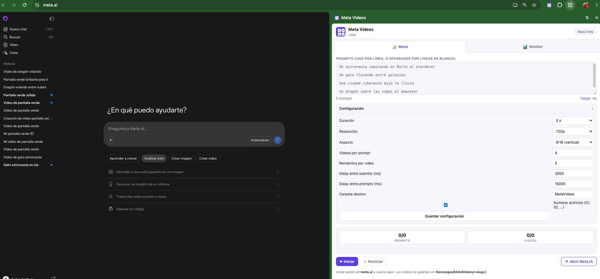

# Meta Videos 4x5s

Extensión para Google Chrome (Manifest V3) que automatiza la generación de
videos en [meta.ai](https://meta.ai) a partir de una lista de prompts.
Implementada en vanilla JS, sin dependencias externas.

## Vista previa



En la captura, el **side panel** de la extensión está abierto a la derecha,
junto a una pestaña de `meta.ai`. En la pestaña **📝 Menú** se aprecia el flujo
completo de un lote:

- La lista de **prompts**, uno por línea (astronauta en Marte, gato entre
  galaxias, ciudad cyberpunk, dragón sobre las nubes).
- El panel de **Configuración** con los ajustes típicos para *reels*:
  duración **5 s**, resolución **720p**, aspecto **9:16 (vertical)**,
  **4 videos por prompt**, 5 reintentos, delays entre submits/prompts y
  carpeta destino `MetaVideos` con numeración de archivos.
- Los contadores **PROMPTS** y **VIDEOS** y los botones **▶ Iniciar**,
  **⟳ Reiniciar** y **↗ Abrir Meta.IA**.
- El recordatorio de que los videos se guardan en
  `Descargas/MetaVideos/<slug>/`.

Al pulsar **▶ Iniciar**, la extensión envía cada prompt a `meta.ai`, espera a
que se generen sus videos y los descarga ordenados en una carpeta por prompt.

## Características

- 📝 Un prompt por línea, o separados por líneas en blanco, en un textarea o un archivo `.txt`.
- 🎬 Genera **N videos por prompt** (configurable, por defecto `4`).
- ⏱️ Duración por video configurable (`4 s` / `5 s` / `6 s`).
- 🖼️ Resolución (`720p` / `1080p`) y aspecto (`16:9` / `9:16` / `1:1`) configurables.
- 🔁 **Reintentos automáticos** por video fallido (configurable, default `3`).
- 🗂️ Descargas en `Descargas/MetaVideos/<slug>/<NN>_<slug>.mp4`.
- 📊 Side panel con monitor en vivo (progreso por prompt y por video).
- ⏸️ Pausa, reanuda y detiene la cola en cualquier momento.
- 🚦 Backoff aleatorio entre submits para evitar rate-limit.
- 🧠 Detección automática del fin de generación por DOM (`<video>` listo).
- 🛡️ Sesión de meta.ai reutilizada (login manual en la web; la extensión
  sólo automatiza la UI).

## Requisitos

- Chrome / Edge / Brave (Manifest V3).
- Cuenta de **meta.ai** con la sesión iniciada en una pestaña.

## Instalación (modo desarrollador)

1. Abre `chrome://extensions`.
2. Activa **Modo desarrollador**.
3. **Cargar descomprimida** y selecciona la carpeta `meta-videos/`.
4. Abre `https://meta.ai` e inicia sesión.
5. Click en el icono de la extensión: se abre el **side panel** con dos pestañas
   (Menú / Monitor). Para alternar entre ellas, usa los botones del header.

> Para regenerar los iconos:
> `python3 meta-videos/scripts/gen_icons.py`

## Uso

1. Click en el icono de la extensión → se abre el **side panel unificado**.
2. En la pestaña **📝 Menú**, pega tus prompts. Cada línea es un prompt, **o
   puedes separarlos con líneas en blanco** para mayor claridad visual. La
   extensión normaliza saltos de línea (`\n`, `\r\n`, `\r`) y descarta
   líneas vacías. Ejemplo (3 prompts):
   ```
   un astronauta caminando en Marte

   un gato flotando entre galaxias

   una ciudad cyberpunk bajo la lluvia
   ```
3. Abre el panel de **Configuración** (botón desplegable) y ajusta:
   - Duración por video.
   - Resolución y aspecto.
   - Cantidad de videos por prompt.
   - Número de reintentos por video fallido.
   - Delays entre submits / entre prompts.
   - Carpeta destino y numeración.
4. Click en **▶ Iniciar**. La extensión:
   - Localiza la pestaña de meta.ai.
   - Si el content script no responde, reintenta 3 veces, lo inyecta
     manualmente y vuelve a probar (esto resuelve errores como
     "meta.ai no responde" cuando se abrió meta.ai antes de instalar
     la extensión).
   - (Best-effort) selecciona el modo **Vídeo** y el **aspecto** (p. ej. 9:16).
   - Escribe el prompt y lo envía **una sola vez** (meta.ai genera varios
     videos por envío de forma nativa).
   - Espera a que terminen de generarse los **N videos** del prompt.
   - Descarga cada uno a `Descargas/MetaVideos/<slug>/<NN>_<slug>.mp4`.
   - Pasa al siguiente prompt con un delay configurable.
5. Cambia a la pestaña **📊 Monitor** para ver el progreso en vivo (cola
   detallada y registro scrolleable). La pestaña activa se recuerda
   entre sesiones.

## Estructura del proyecto

```
meta-videos/
├── manifest.json
├── background.js         # Service worker: cola, downloads, reintentos, abre side panel al click
├── content.js            # Driver DOM dentro de meta.ai
├── lib/
│   ├── slug.js           # slug + pad2
│   ├── delay.js          # sleep, randomDelay, backoff
│   ├── selectors.js      # Selectores centralizados (¡retunear aquí si meta.ai cambia!)
│   └── downloader.js     # fetch → dataURL → chrome.downloads
├── sidepanel/            # Side panel unificado con dos pestañas (Menú / Monitor)
│   ├── sidepanel.html
│   ├── sidepanel.css
│   └── sidepanel.js
├── icons/                # 16/48/128
└── scripts/gen_icons.py  # regenera los iconos
```

## Cómo funciona (resumen técnico)

1. **Click en el icono** → el background (MV3) abre el side panel vía
   `chrome.action.onClicked` + `chrome.sidePanel.open`.
2. **Side panel** (`sidepanel/sidepanel.{html,css,js}`) es la única UI
   expuesta. Tiene dos pestañas (Menú / Monitor) que se persisten en
   `chrome.storage.session`.
3. **Background** mantiene la cola en `chrome.storage.session` y procesa
   un job a la vez (**un submit por prompt**; espera los N videos, los
   descarga y avanza al siguiente).
4. **Content script** (`content.js`) corre en `https://meta.ai/*`. Anuncia
   `READY` al cargar; recibe `SUBMIT_PROMPT` desde el background, escribe
   el prompt en el editor de meta.ai, lo envía **una vez**, y observa el DOM
   hasta que el último contenedor de resultados deja de generar y aparecen
   los `<video>` **nuevos**.
5. **Detección de resultados**: `lib/selectors.js` se limita al **último
   contenedor** de mensaje (`div[data-message-item]`) para no mezclar con
   videos de prompts anteriores; sólo se descargan los `<video>` nuevos
   (con un snapshot previo de los existentes como salvaguarda).
6. **Ping robusto**: si el content script no responde al primer PING, el
   background reintenta 3 veces, lo inyecta manualmente con
   `chrome.scripting.executeScript`, y reintenta una vez más.
7. **Descarga**: por cada `<video>` nuevo, el content lee su `src` (URL
   directa de `fbcdn`, o `blob:` → `data:`) y pide al background descargarlo
   con `chrome.downloads.download` (`conflictAction: 'uniquify'`).
8. **Reintentos**: si un prompt falla (error, timeout o sin descargas), el
   background reintenta el envío con backoff exponencial hasta `maxRetries`.
   Si se agota el límite, **marca el prompt en error y continúa** con el
   siguiente.
9. **Side panel** recibe `STATE` por broadcast y muestra progreso por
   prompt (con `01..NN` por video, ✓/✗/⟳) y log scrolleable.

## Limitaciones conocidas

- `meta.ai` genera **varios videos por envío** de forma nativa (≈4). La
  extensión hace **un solo submit por prompt** y descarga todos los videos
  resultantes. Los delays por defecto entre prompts son intencionales para
  evitar rate-limits si hay muchos prompts en cola.
- Si `meta.ai` cambia su DOM, los selectores en `lib/selectors.js`
  probablemente requieran ajustes. Ese es el único archivo que debería
  tocarse en ese caso.
- La **duración/resolución** dependen del modelo de `meta.ai` y puede que no
  sean configurables desde su UI; la extensión las solicita best-effort y
  descarga el video resultante igualmente.
- El login es **manual**: la extensión no almacena credenciales.

## Privacidad

- No se envía ningún dato a servidores externos.
- La sesión de `meta.ai` se reutiliza tal cual (la extensión no la lee).
- Los prompts se procesan localmente y se envian a `meta.ai` por la pestaña
  del navegador del usuario.

## Tests

La carpeta `test/` contiene una suite automatizada en 4 capas que NO requiere
meta.ai real (usa una página simulada):

```
cd meta-videos/test
npm install                    # @playwright/test + jsdom
npx playwright install chromium  # binario de Chromium (solo la 1a vez)
npm test                       # corre las 4 capas (abre Chrome para la integración)
node run-all.mjs --fast        # omite la capa de integración (sin Chrome)
```

| Capa | Qué valida |
|---|---|
| **lint** | `manifest-validate` (schema MV3 + archivos referenciados) + ESLint `no-undef` (atrapa bugs como usar `window` en el service worker) |
| **unit** | `lib/slug.js`, `lib/delay.js`, `lib/parser.js` (parser de prompts), nombres de archivo `MetaVideos/<slug>/NN_<slug>.mp4` |
| **dom** | `lib/selectors.js` contra fixtures HTML tipo meta.ai (jsdom) |
| **integration** | Carga la extensión real en Chrome (Playwright, solo Chromium) + una mock page; verifica el flujo completo: escribir → enviar → detectar `<video>` → descargar; 4 videos por prompt; reintentos; descarte tras agotar reintentos; reinicio (RESET); side panel sin errores |

La config de los tests vive en `test/fixtures/config.json` (5 s, 720p, 9:16,
4 videos, 5 reintentos…).

### E2E real contra meta.ai (opcional)

Además del mock, hay un test **end-to-end contra meta.ai real** que maneja la
extensión de verdad (perfil persistente con login manual, descarga real y
verificación con `ffprobe` + tono dominante):

```
cd meta-videos/test
npm run test:real            # 3 prompts × 4 videos (reusa tu sesión de meta.ai)
MV_SMOKE=1 npm run test:real # validación rápida: 1 video
```

> La primera vez abre un Chrome para que inicies sesión en `meta.ai`; el perfil
> queda guardado en `test/.auth-profile/` (ignorado por git) para reusarse. Los
> selectores reales se afinan con los scripts de `test/cdp/`
> (`--remote-debugging-port=9222`).

## Licencia

Este proyecto se distribuye bajo la licencia **MIT**. Consulta el archivo
[LICENSE](LICENSE) para más detalles.

## Autor

**Pedro GV** — [@furthurr](https://github.com/furthurr)
